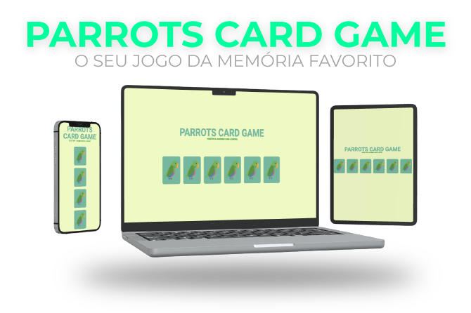

Jogo da memoria desenvolvido com tecnologias vanilla, clique no link do deploy e se divirta jogando Parrots Card Game. :bird:

## Tecnologias 
Algumas tecnologias usadas:

* HTML5
* JavaScript
* CSS

## Serviços
* Github

## Visão Geral do Game:

## Links
  - Deseja jogar um pouco de **Parrots Card Game** ?: ***https://pedro-hen46.github.io/ParrotsGame/***
  - Repositório: ***https://github.com/Pedro-Hen46/ParrotsGame***

  ## Autores

  * **Pedro Henrique dos Santos Silva** 

  
  
  Me siga no [**Github**](https://github.com/login?return_to=https%3A%2F%2Fgithub.com%2FPedro-Hen46) e Faça uma conexão no [**LinkedIn**](https://www.linkedin.com/in/pedro-henrique-dos-santos-silva-05012289) ❤

  Obrigado por visitar. 
